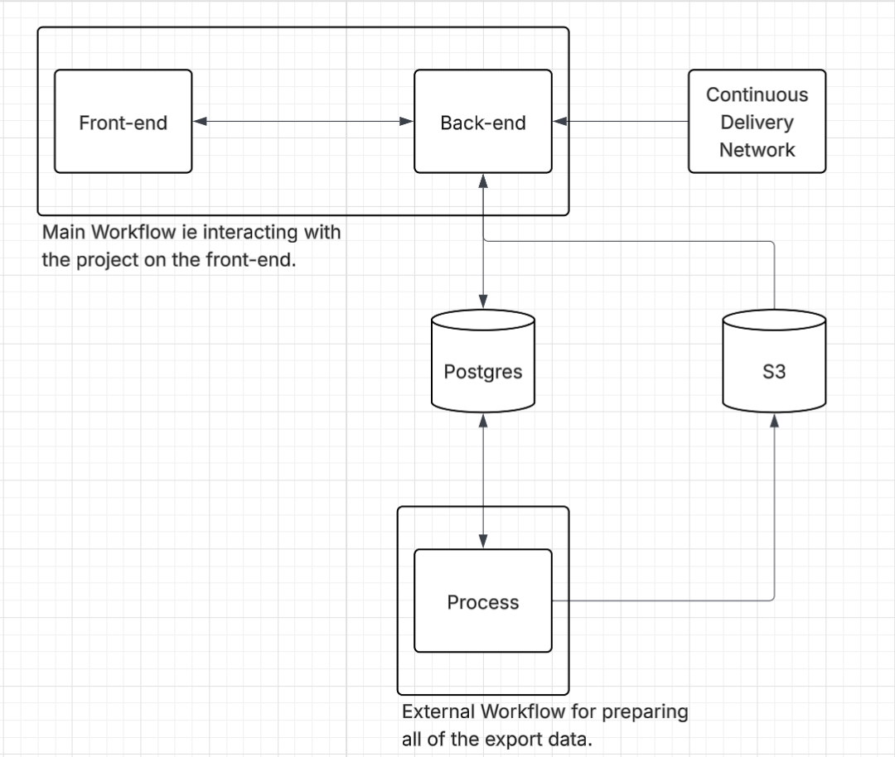

## Scaffold

I love taking notes on books that I read, but I hate it when I have to look at the table of contents, type it out and then start reading the book, so I decided to build something to solve this problem.

## Architecture

## Tech Stack

### Front-End

- React (I'm most familar with it so it allows me to iterate fast)
- Next.js (I liked the additonial features it offers and its something I wanted to learn)

### Back-End

- Python (Super familar with it so I can iterate fast)
- TypeScript + Express (Super familar with it and I wanted to try out Prisma)

### Database

- Prisma (I wanted to save on costs and the Prisma Postgres free-tier was enough to cover this)
- S3 (Needed a bucket to store static assets such as images as well as the export data ie markdown, text files)

### Deployment

- CloudFlare (Super easy and allows me to deploy the front-end in minutes)
- AWS + AWS CDK (Super familar with it, so I can iterate fast and it has extremely detailed documentation)

### Access Today

It can be accessed [here](https://query-atn.pages.dev/)!

### Local Development

To get this running locally do the following.

1. Make sure you have Docker desktop installed.
2. To start the back-end, enter the back-end directory and run `just set-up-local-dev`. However, there is no seed data but this will be added soon.
3. To start the front-end, enter the front-end directory and run `npm run dev`.
